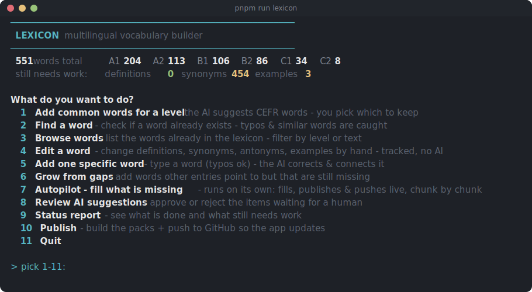

# Lexicon Platform

**[Browse the content live](https://massimomazzariol.github.io/Lexicon/)** - the
explorer reads the exact distribution consumers download: 646 concepts across
German, English, and Italian, CEFR-leveled A1 to C2, with definitions,
morphological forms, examples, and idiomatic expressions.

Lexicon Platform is a standalone, reusable lexical content repository: a single
curated source of vocabulary, built into versioned runtime packs and published as
a file-based JSON distribution. Consumers integrate through that distribution
only. They never depend on this repository's source or build, and it never
reaches into a consumer (see `CONTRACT.md` and `docs/adr/`).

## Why this exists

Open, reusable lexical data for language learning is hard to find. Public
sources are scattered and inconsistent: definitions vary by source, examples
are uneven, CEFR levels are rarely coherent, and the relations between words
are mostly missing. The coherent datasets sit inside proprietary apps.
Generating entries live per request costs money on every call, returns a
different answer each time, fails offline, and gives a learner no way to
tell a good entry from a bad one.

Lexicon consolidates the knowledge once into a curated source of truth, then
materialises it into static, versioned, downloadable packs:

- **Deterministic and reviewable** - a word always returns the same vetted entry;
  the source is content-as-code, so every change is a reviewable diff.
- **Leveled and interconnected** - CEFR levels (A1 to C2) and concept relations are
  global judgments made once, not re-derived per request.
- **Static and cheap to serve** - consumers download prebuilt packs and serve them
  locally; no per-use generation, no live model call, no scaling cost.

## How it works

- **Content-as-code.** One curated source pack builds into versioned runtime packs
  plus the file-based distribution contract.
- **Capability-driven language plugins.** Morphology (German noun declension,
  separable verbs like `auf|stehen`) is rule-derived with curated irregulars; the
  core stays language-neutral, so a new language is a plugin, not a core change.
- **Reviewed, never auto-shipped.** Entries are staged `needs_review`; a guardrail
  gate promotes only the clean ones, the build excludes the rest, and the final
  check is the git diff.

## Authoring

Content is grown and tended from a single console (`pnpm run lexicon`):

Every record passes human review (the git diff is the gate) before it is
built into a pack.

## Consuming the content

Integrate through one contract only: the file-based JSON distribution
(`root_manifest.json` + per-language indexes + per-pack `manifest.json` and
`content.json`). Every manifest carries `contract_version`, so a consumer detects
and rejects an incompatible distribution instead of drifting silently.

Consumers only read a published distribution; they never build or publish one.
Parse it per `CONTRACT.md` and `docs/guides/CONSUMER_GUIDE.md`.

## Releasing (maintainers)

Building and publishing are maintainer tasks, not consumer tasks. The publish
script uploads to the GitHub Releases of this repository: `gh` resolves the
target from the checkout's `origin` remote, so it needs `gh auth` with write
access here (on a fork it publishes to the fork's own Releases). Without
`--publish` the script is a dry run and changes nothing.

- **Build:** `pnpm run release` writes `dist/lexicon_distribution/`
- **Publish:** `pnpm run publish -- --publish --tag <tag>` uploads flat assets
  to the GitHub Release for that tag
- **Checklist:** `docs/guides/RELEASING.md`

## Docs

- `CONTRACT.md` - the distribution contract (the only consumer contract)
- `docs/README.md` - documentation map and reading order
- `docs/guides/CONSUMER_GUIDE.md` - integrating the distribution
- `docs/guides/PACK_AUTHORING.md` - source-pack authoring workflow
- `docs/reference/WORKFLOW_COMMANDS.md` - canonical command reference
- `docs/guides/RELEASING.md` - release + publish checklist
- `CONTRIBUTING.md` - contribution guide

## Licensing

Code (`tools/`) is `Apache-2.0`; lexical content, packs, and docs are `CC BY 4.0`
unless noted otherwise, keeping the repository open and reusable while preserving
attribution. See `LICENSE`, `docs/CONTENT_LICENSE.md`, `NOTICE`, `ATTRIBUTION.md`.
